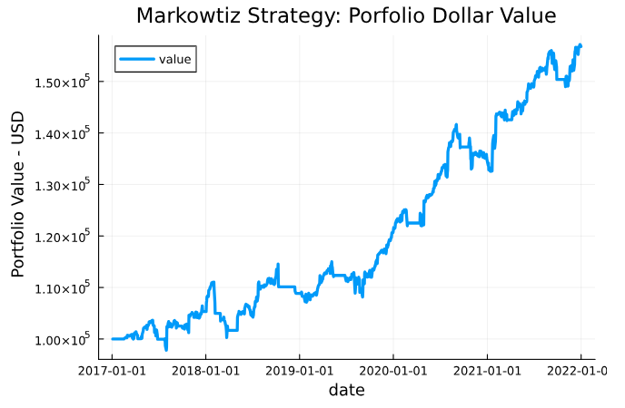

# AirBorne
[](https://github.com/JuDO-dev/AirBorne.jl/actions/workflows/CI.yml)
[](https://github.com/invenia/Blue)
[](https://codecov.io/gh/JuDO-dev/AirBorne.jl)
[](https://judo.dev/AirBorne.jl/dev/)
[](https://github.com/SciML/ColPrac)

Welcome to the AirBorne a complete algorithmic trading framework for Julia.

This module simplifies algorithmic trading by providing a set of ready to use backtesting algorithms, templates for common trading strategies, full ETL (Extract Transform Load) data pipelines with datasources such as NASDAQ and Yahoo Finance. The philosophy of the design of this module is best represented by the diagram below.


> **Note:** As of version 0.1.0 AirBorne does not have the functionality to operate as live server nor interact with third party broker APIs, however a seamless transition between trading strategies in AirBorne backtesting engines is one of the goals of the project and shall be prioritized in due course.

## How to use AirBorne

### Installation
Airborne is a %100 Julia native package, so making use of it is as simple as installing a module.
```julia
using Pkg;
Pkg.add(url="https://github.com/JuDO-dev/AirBorne.jl#dev");
```

### Usage
There are many examples through our documentation from how to define trading strategies for a backtesting engine using Model Predictive Control to how to perform simple queries to fetch ticker data using the ETL and store it for later use.

Nonetheless a very brief example on some of the functionalities of this package will be shown here.

#### Data Pipeline Functions
```julia
# Fetch data from NASDAQ API, returning its screener data (https://www.nasdaq.com/market-activity/stocks/screener)
using AirBorne.ETL.NASDAQ: screener
tickers_df = screener() 

# Fetch OHLCV data from YahooFinance on Apple and Google tickers
using AirBorne.ETL.YFinance: get_interday_data
using Dates: DateTime,datetime2unix
unix(x) = string(round(Int, datetime2unix(DateTime(x))))
data = get_interday_data(["AAPL","GOOG"], unix("2017-01-01"), unix("2022-01-01"))
first(data,4) # Display first 4 rows
```


#### Backtesting
Backtesting has nuances, it basically consists of testing a trading strategy using past data. 

But looking closer one needs to consider many things such as:
1. In which format and over which times an exchange provides data?
2. How is an asset priced in the market, would it depend on the order size? There are many theories around this, which one to use?
3. Can orders be unsuccessful? How an order be executed partially?
4. What are the fees for a broker broken down?
5. How is the simulation executed?  


All of the points above are dealt thoroughly in AirBorne's documentation. 

Observe how easily and in few lines one can do 5 years of backtesting using the data extracted in the previous example, using AirBorne's **Discrete Event Driven Simulation** (DEDS) engine along with our **Static Market** model whilst implementing a Markowtiz mean variance strategy. 

```julia
# Using the data from Yahoo Finance, apply a Mean-Variance Markowitz strategy
using AirBorne.Engines.DEDS: run
using AirBorne.Markets.StaticMarket: execute_orders!, expose_data
using AirBorne.Strategies.Markowitz: initialize!, trading_logic!
using Dates: DateTime

# Preselect the trading events (trading events can be added on the fly during strategies, this step is optional)
evaluationEvents = [TimeEvent(t, "data_transfer") for t in sort(unique(data.date); rev=true)]

# Indicate that the market will provide data incrementally to the strategy
my_expose_data(context,data) = expose_data(context,data; historical=false)

# Run backtest
context = run(data, initialize!, trading_logic!, execute_orders!, my_expose_data;
    audit=true, max_date=DateTime(2022, 1, 1), verbose=true, initialEvents=evaluationEvents)

# context contains the portfolio at the end of the backtest s 
portfolio_at_end_of_trading_simulation = context.portfolio
current_accounts_at_end_of_trading_simulation = context.accounts

# If audit is set to true during the simulation it also contain snapshots
snapshot_of_portfolio_at_the_end_of_each_simulation_event = context.audit.portfolioHistory

# Visualize portfolio value over time
using AirBorne.Structures: summarizePerformance
using Plots: plot
results = summarizePerformance(data, context) # Use the audit history to ana
plot(results.date, results.dollarValue, title="Markowtiz Strategy: Porfolio Dollar Value", label="value", xlabel="date", ylabel=" Portfolio Value - USD", linewidth=3)
```



## Want new features or questions answered?
We are thrilled to know that you want our package to grow, there are a couple of ways for you to suggest (and event put forward) new features.

1. **Raise an issue:** We will look into request among the issues and pro
1. **Put a merge request:** We are thrilled to review merge request with new features, we have an CI pipeline in place that will let you know if any of your MRs needs tinkering, from checking for typos and code linting to unit tests.

> **Request for definitions in the documentation are also welcome!** It is very important for the project to establish a common unambiguous ground for concepts. This includes being able to define what is a portfolio, what is an investor, a broker and an exchange. Therefore the documentation in this package will include definitions for all the financial elements modelled in this package and more backed up with references to reliable sources. If you don't find something or think some of the definitions can be improved raise an issue, we shall be happy to abide! 