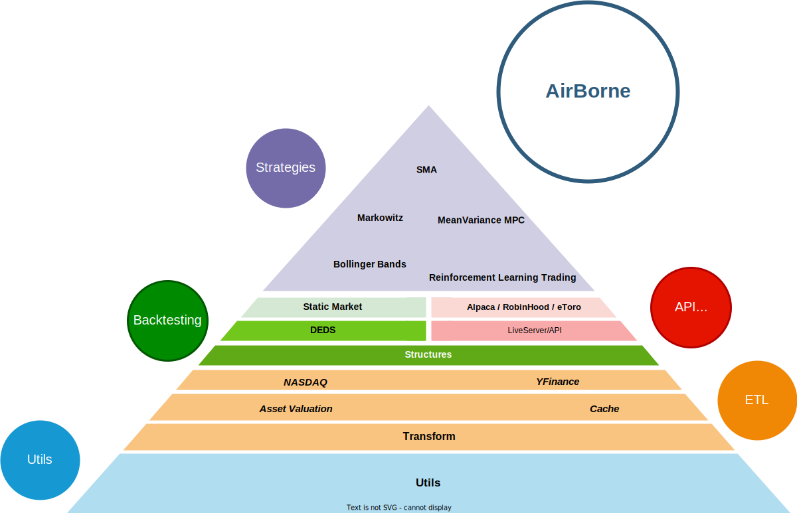

# High Level Design (HLD)
In this section definition for the main objects in this package are presented as well as an introduction to the main logic behind the structure of the package.

## Mission and Vision
Before introducing the HLD of AirBorne the first thing to address is the **mission** of AirBorne (the objective it pursues and reason to exist),as well as its **vision** (the place it aims to be in the world). The HLD will flow from both of them.

> **AirBorne's mission**: To simplify algorithmic trading in Julia, providing a seamless, friendly and effortless interface for any user to be able to test any investment strategy with the highest accuracy and transparency.

> **AirBorne's vision**: To be the module of choice for any Julia practitioner with interest in algorithmic trading, providing high quality methods backed up by academic research and professional expertise.

## Module High Level Design

The software at its core is composed of 3 elements:

1. **Data Layer:** This defines data structures and provides a centralized layer to fetch data from different sources. This includes fetching data from the web, private business API endpoints and the cache of data in the system. With the aim of being as fast and efficient as the Julia language and computational resources allow.
2. **Simulation Framework:** Before any real trading can happen steps to mitigate risk must be taken, the simulation framework has the aim of analyse the performance of trading strategies under a set of hypothesis specified by a Market Model, moreover algorithms for the adjustment of hyperparameters of strategies are also part of its domain. 
3. **Live Trading Framework:** When executing a trading strategy in real time, a reactive fast and efficient computational centre needs to be put in place, moreover its design needs to be compatible with the broker and or exchanges executing the orders, the aim of the **Live Trading Framework** is to provide a seamless interface between Trading strategies and real time trading agents like brokers and exchanges, being as fast, safe, reliable and accurate as possible. 

## Module Pyramid
The module pyramid is helpful to visualize the dependencies and structures inside the AirBorne module. 

AirBorne in fact is made of several submodules interconnected in a purposeful manner. 

1. First **Utils** contains boilerplate functions used throughout the module, this are mainly put forward due to limitations on the opartions of dependencies, i.e., manipulation of arrays and dataframes. All other modules at some point leverage some functions from **Utils**.
2. Second **ETL**, the datapipeline defines the format of the data, the interaction with datasources and how data is stored and loaded, any functionality of AirBorne that interacts with data is  designed to work in armony with the native ETL pipeline. However the **ETL** pipeline has layers of its own.
    1. The first one is **Transformation**: Where formats of data and common transformations are implemented
    2. Then in parallel we have **AssetValuation and Cache**. AssetValuation has additional transformations capable of valuate datastructures containing assets, here you may find some common pricing models that markets can leverage. **Cache** decides how data is persisted and brought back from persistent storage (usually the hard drive or cloud storage), it provides tools to analyse the bundles of data, label them, archive and version them, allowing reproducible reporting of results and backup of large amount of historical data.
    3. Lastly on the last ETL layer we have the **External sources** of data such as **NASDAQ** or **YFinance** (Yahoo finance).
3. The 3rd layer is **Backtesting/Broker Interface**, this layer is split the purpose of this layer is the placement of the required infrastructure for strategies to be executed, either in backtesting, paper trading or live trading. Strategies will be designed with those structures in mind. This layer has also their own sublayers.
    1. First **Structures** provides data structures to represent entities such as portfolios, options and assets, it provides the common language for all trading environments to speak in.
    2. When Backtesting 2 additional sublayers are introduced:
        1. Engines: Where simulations are run
        2. Markets: Entities that decide how to execute orders placed by strategies (including the accruing of fees) and present data to the strategies.
    3. When Live Trading or paper trading 2 additional layers are proposed (not yet implemented):
        1. LiveServer/API: This layer provides the necessary tool to set up a server that is up all the time, and can be used to interact with brokers, exchanges and third party websites that allow papertrading.
        2. Individual connections: On top of this server individual connections to brokers such as Alpaca or RobinHood can be put in place, so that native Julia commands can be used to interact with them, to place orders or retrieve data.
4. **Strategies**: Strategies are functions that given a context and new data can produce orders to be executed by a market.